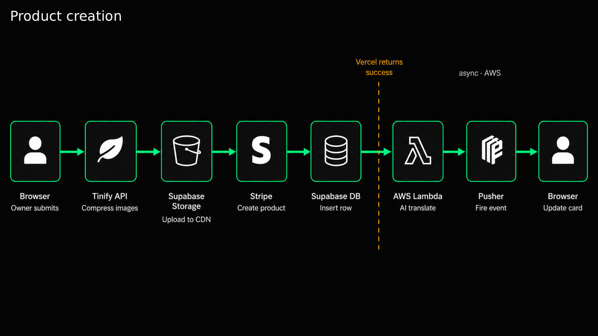
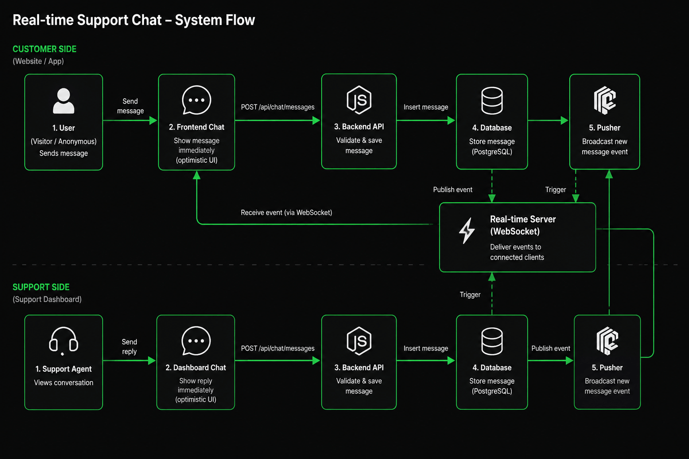
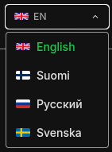

# 23 Store &nbsp; [live demo](https://23-store.vercel.app/)

### Internationalisation (EN / FI / RU / SE)

---

---

## Performance

| Date       | Mobile | Desktop |
| ---------- | ------ | ------- |
| 01.03.2024 | 35     | 73      |
| 24.03.2024 | 74     | 94      |
| 15.07.2024 | 65     | 99      |
| 16.08.2025 | **85** | **92**  |

---

## Stack

| Layer               | Tech                                                              |
| ------------------- | ----------------------------------------------------------------- |
| Framework           | Next.js 16 + TypeScript + Tailwind                                |
| Auth + DB + Storage | Supabase                                                          |
| Payments            | Stripe · PayPal · MetaMask                                        |
| State               | Zustand                                                           |
| Real-time           | Pusher                                                            |
| AI                  | OpenAI gpt-5.4-nano and gpt-5-nano on AWS Lambda for product i18n |
| Email               | Resend                                                            |
| Price data          | CoinMarketCap API                                                 |
| Infra               | Vercel (web) + Docker (local)                                     |

---

## DB schema overview

Full SQL (tables, RLS policies, storage buckets, backup function) → [dev_readme-supbase-sql.md](./dev_readme-supbase-sql.md)

---

## Contributing

Want to run it locally or contribute? See [CONTRIBUTING.md](./CONTRIBUTING.md) for setup instructions (Docker or manual `.env`), branch naming, commit conventions, and PR guidelines.

---

## ⚠️ Decisions Made Against

**Maintaining This Project**

I fix one issue - see another - fix another - see the next one - it's never ending mirage 
All these successfull people are telling one advice - **focus** - so I will focus on 1 project instead of 3

---

## Feedback

Found a bug? [Open an issue](https://github.com/nicitaacom/23_store/issues/new).
