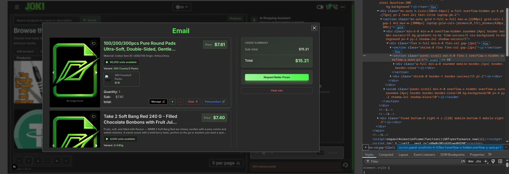
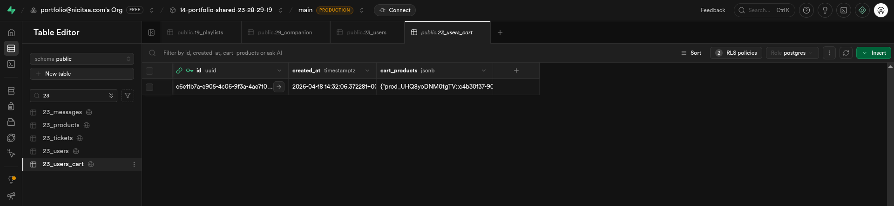

# CartModal — Dev Readme

## 0. Why this exists

The cart modal lets users review items they've added, adjust quantities, clear the cart, and proceed to checkout. It opens via the cart icon in the Navbar and is driven by query param `modal=CartModal`.

Checkout offers 4 ways to pay:

- **MetaMask** — ETH, BNB, MATIC (EVM chains)
- **Solana** — SOL, signed by Phantom (see §5)
- **PayPal**
- **Stripe**

---

## 1. How does it look


`public/docs/cart/CartModal.png` — `app/components/ui/Modals/CartModal/CartModal.tsx`


`public/docs/cart/db-23_users_cart.png` — Supabase `23_users_cart` table

---

## 2. Where data lives

```
Supabase DB 23_users_cart
  id           UUID  FK -> auth.users(id)
  cart_products JSONB  { [productId]: { quantity, price, title, img_url, variant } }

Zustand cartStore  (app/store/ui/cartStore.ts)
  cartProducts: Record<string, CartProduct>
  -> synced to DB on every change via debounced upsert
```

---

## 3. Directory

```
app/components/ui/Modals/CartModal/
  CartModal.tsx        <- shell: empty state vs product list
  EmptyCart.tsx        <- empty state illustration
  ProductsInCart.tsx   <- cart items + the order summary aside that renders <PaymentButtons />
  PaymentButtons/      <- MetaMask + Solana + PayPal + Stripe checkout buttons
  functions/           <- cart helpers (add, remove, clear, upsert to DB)
```

---

## 4. How to open

Cart modal uses the query-param pattern (see `app/components/ui/Modals/dev_readme.md`).

```
Navbar cart icon -> href adds ?modal=CartModal
ModalsProvider renders <CartModal /> when searchParams includes "CartModal"
```

---

## 5. Paying with Solana

### 5.1 Why this exists

`@solana/web3.js` sat in `package.json` for a Solana option that was never finished. What was there before:

- `SOLANA = "0x1"` in `sendMoneyWithMetamask.ts` — the same value as `ETH_MAINNET`, so `case SOLANA:` never ran. Solana is not an EVM chain and has no EVM chain id.
- A commented block calling `Keypair.fromSecretKey(wallet.secret)` — a raw secret key living in the browser.
- `TWallet.secret?: number[]` feeding only that commented block.

All 3 are deleted. The working button signs through the wallet extension, so no secret key is ever read by this codebase.

### 5.2 Terminology

- **Injected provider** — a wallet extension putting itself on `window`. MetaMask uses `window.ethereum`, Phantom uses `window.solana`.
- **Lamport** — SOL's smallest unit. 1 SOL = 10^9 lamports. The direct analogue of wei.
- **Cluster** — which Solana network to talk to: `devnet`, `testnet` or `mainnet-beta`.
- **Base58 address** — a Solana public key. No `0x` prefix, and `0`, `O`, `I`, `l` are left out of the alphabet.

### 5.3 Files

| Piece               | File                                                                    |
| ------------------- | ----------------------------------------------------------------------- |
| Button              | `PaymentButtons/components/PayWithSolanaButton.tsx`                     |
| Send function       | `PaymentButtons/functions/sendMoneyWithSolana.ts`                       |
| Provider type       | `env.d.ts` — `TSolanaProvider` + `window.solana`                        |
| Recipient + cluster | `env.d.ts` — `NEXT_PUBLIC_SOLANA_ADDRESS`, `NEXT_PUBLIC_SOLANA_CLUSTER` |
| Icon                | `public/solana.png`                                                     |
| Copy                | `app/locales/en.ts` / `fi.ts` / `ru.ts` / `se.ts`, `payment.error.*`    |
| Story               | `storybook/commerce/Checkout.stories.tsx`                               |
| Rendered by         | `ProductsInCart.tsx` — the order summary aside                          |

### 5.4 How one click pays

```
click "Solana"  (PayWithSolanaButton.tsx)
  |
  |-- window.solana?.isPhantom missing -> toast "Phantom not detected" + install link -> STOP
  |-- NEXT_PUBLIC_SOLANA_ADDRESS empty -> toast "Configuration Error"           -> STOP
  |-- address fails base58 regex       -> toast "Configuration Error"           -> STOP
  |
  v
window.solana.connect()          <- already trusted wallet resolves with no prompt
  |
  v
sendMoneyWithSolana.ts
  1. productsSDK.getCoinmarketcapQuote({ amount: cartUSD, symbol: "USD", convert: "SOL" })
  2. amountInSol = data[0].quote.SOL.price          <- SOL equal to the cart's USD total
  3. lamports    = round(amountInSol * 10^9)
  4. new Connection(clusterApiUrl(cluster), "confirmed")
  5. Transaction { feePayer, blockhash } .add(SystemProgram.transfer)
  6. window.solana.signAndSendTransaction(tx)       <- extension signs, returns a signature
  7. connection.confirmTransaction(...)
  |
  v
router.push("/payment?status=success")
```

The MetaMask button needs 2 clicks — one to connect, one to pay. Solana does both in one, because the button says Solana and the user pressed it to pay.

### 5.5 Env vars

```
NEXT_PUBLIC_SOLANA_ADDRESS   base58 public key money is sent to
NEXT_PUBLIC_SOLANA_CLUSTER   devnet | testnet | mainnet-beta   (falls back to devnet)
```

Flipping to real money is a value change on `NEXT_PUBLIC_SOLANA_CLUSTER`, not a code change. The RPC endpoint comes from `clusterApiUrl(cluster)` — the free public endpoint, rate limited, no signup.

### 5.6 Decisions made AGAINST

| Rejected                                        | Why                                                                                                                                                     |
| ----------------------------------------------- | ------------------------------------------------------------------------------------------------------------------------------------------------------- |
| `@solana/wallet-adapter-*` packages             | Zero new packages needed. `window.solana` mirrors `PayWithMetamaskButton.tsx` 1:1. Cost: only Phantom and wallets that inject `window.solana` work.     |
| Server-side signature check before the redirect | Matches the MetaMask trust model this codebase already ships (`sendMoneyWithMetamask.ts:93`). Revisit together with MetaMask, not separately.           |
| A paid RPC endpoint                             | Free public cluster is enough at today's order volume.                                                                                                  |
| USDC and other SPL tokens                       | v1 is SOL only — one native coin per chain, same as ETH/BNB/MATIC. An SPL transfer needs an associated token account, which is a different instruction. |
| Reviving `Keypair.fromSecretKey`                | It puts a raw private key in the browser.                                                                                                               |
| Hardcoded SOL price                             | Priced live through CoinMarketCap, same method the EVM chains use.                                                                                      |

### 5.7 TODO

**Guests get no check offer**

- MetaMask opens `DoYouWantReceiveCheckModal` when there is no signed-in user. Solana pays directly.
- Reproduce: sign out, add a product, open the cart, press Solana — no email prompt appears.
- Cause: `DoYouWantReceiveCheckModal.tsx:57` calls `sendMoneyWithMetamask` hard-wired.
- Routing Solana through it as-is would send with the wrong wallet.
- Fix: that modal has to know which wallet asked for it.
- **Screenshot missing.** Add `public/docs/cart/solana-button.png` and link it in §1.
- **Untested against a real wallet.** The devnet path has not been run end to end with Phantom installed.
