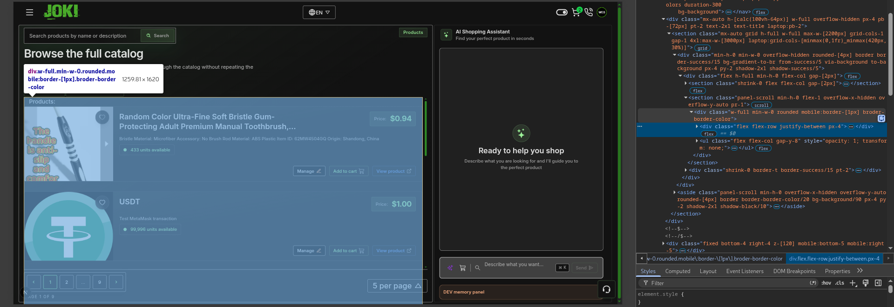
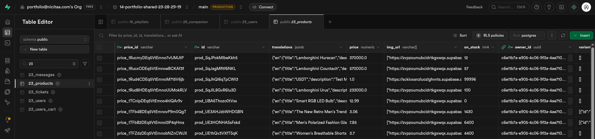

# Create Product — Dev Readme

## 0. Why this exists

Creating a product is non-trivial: images must be compressed (Tinify), uploaded to Supabase Storage, a Stripe product+price must be created, the DB row must be inserted, and then the title/description must be translated into 4 languages by an AWS Lambda calling OpenAI. The full pipeline takes 3–5 minutes — longer than Vercel's function timeout — so the app shows an optimistic UI immediately and lets Lambda finish asynchronously, notifying the client via Pusher when done.

---

## 1. How does it look


`public/docs/products/Products.png` — `app/[locale]/(site)/components/`


`public/docs/products/db-23_products.png` — Supabase `23_products` table

Product image → its path:

```text
  title:  "сливки 30%"
              │
              │  slugify: % → pct, cyrillic → latin
              ▼
  slug:   "slivki-30pct"
              │
              │  Stripe creates the product
              ▼
  productId:  "prod_T1IRAxDEq5VtEmno"
              │
              ▼
  ┌────────────────────────────────────────────────────────────┐
  │ 23_product-images/nicitaacomgmailcom/prod_T1IRAxDEq5VtEmno/│
  │ slivki-30pct-1.jpg                                         │
  └────────────────────────────────────────────────────────────┘
    ├─ nicitaacomgmailcom      → owner email, slugged
    ├─ prod_T1IRAxDEq5VtEmno   → productId — delete this folder, delete the product
    └─ slivki-30pct-1.jpg      → title slug + position
```

---

## 2. Where data lives

### Stores & sources

| Layer                                              | What it holds                                                                                             | Why here                                                                     |
| -------------------------------------------------- | --------------------------------------------------------------------------------------------------------- | ---------------------------------------------------------------------------- |
| `react-images-uploading` (local state)             | Raw `File` objects + `data_url` previews before upload                                                    | Never leaves the browser; discarded after upload                             |
| Supabase Storage `23_public-images` bucket         | Compressed product images (public URLs)                                                                   | Permanent, CDN-served, referenced by DB rows                                 |
| Supabase DB `23_products`                          | Product row: `id`, `price_id`, `owner_id`, `translations`, `price`, `on_stock`, `img_url[]`, `variants[]` | Source of truth for the storefront                                           |
| Stripe                                             | Product + Price objects                                                                                   | Required for checkout; `id`/`price_id` from Stripe become the DB primary key |
| Zustand `ownerProductsStore`                       | Owner's products list in memory                                                                           | Drives the Admin Panel edit/delete UI without re-fetching on every action    |
| Pusher channel `products`, event `product:created` | Fires after Lambda finishes translating                                                                   | Lets the client swap the optimistic row for the real translated product      |

### DB schema (`23_products`)

```ts
{
  id: string          // Stripe product ID (primary key part)
  price_id: string    // Stripe price ID (primary key part)
  owner_id: UUID      // FK to auth.users(id)
  translations: {     // filled with source text first; Lambda replaces with translations
    en: { title: string; description: string }
    fi: { title: string; description: string }
    ru: { title: string; description: string }
    se: { title: string; description: string }
  }
  price: number       // base price (first variant price)
  img_url: string[]   // Supabase Storage public URLs
  on_stock: number
  variants: null | Array<{
    id: string
    label: string
    image_url: string  // one of the img_url entries — snapshot at creation time
    price: number
  }>
}
```

### UI directories

```
app/components/ui/Modals/AdminPanel/
  components/
    AddProductForm.tsx          <- the form the owner fills in (Add tab)
    FormatImagesForm.tsx        <- image grid in Edit tab (add/delete/reorder existing images)
    EditProductForm.tsx         <- lists owner products in Edit tab
    OwnerProduct.tsx            <- one product card with FormatImagesForm at the bottom
  hooks/
    useSubscribeToProductCreated.ts  <- Pusher listener; swaps optimistic row for real one
app/functions/
  createProductFn.tsx           <- orchestrates the full pipeline (called by AddProductForm)
  createProductHelpers.ts       <- individual pipeline steps (tinify, upload, stripe, etc.)
app/api/products/
  translate-insert/
    route.ts                    <- Next.js POST route: inserts DB row + invokes Lambda
    insertDBProduct.ts          <- supabaseAdmin insert into 23_products
    invokeTranslateProductLambda.ts  <- AWS SDK Lambda.send with 20s timeout
index.mjs                       <- AWS Lambda handler (lives outside this repo in AWS)
```

---

## 3. Terminology

| Term                        | Meaning                                                                                                                                                                                                             |
| --------------------------- | ------------------------------------------------------------------------------------------------------------------------------------------------------------------------------------------------------------------- |
| **Optimistic product**      | A fake `TProductDB` row added to `ownerProductsStore` immediately so the UI feels instant. Has `id: "optimistic-<uuid>"`.                                                                                           |
| **Pending created product** | Entry in `pendingCreatedProductsRef` (a ref array in `AddProductForm`) that maps an optimistic ID to the real owner/title/price so Pusher can match and replace it.                                                 |
| **Raw translations**        | All 4 locales set to the same source text (`createRawProductTranslations`). Shown until Lambda finishes.                                                                                                            |
| **Lambda translate**        | AWS Lambda `23-ai-translate` (`index.mjs`): calls OpenAI, upserts translated row into `23_products`, fires `product:created` on Pusher.                                                                             |
| **Tinify**                  | Image compression via `/api/products/compress`. Runs before upload to keep Storage lean.                                                                                                                            |
| **Variant**                 | A selectable option on a product (e.g. colour, size). Each variant stores its own `image_url` — a snapshot of one `img_url` entry at creation time. If images are later re-uploaded, variant URLs must be remapped. |

---

## 4. How it works — full pipeline

```
AddProductForm (browser)
app/components/ui/Modals/AdminPanel/components/AddProductForm.tsx

User fills: title, description, images (ImageListType), variants, on_stock
-> clicks "Create product"
-> calls createProductFn(t, input)    app/functions/createProductFn.tsx


STEP 1 — resolve source images
  resolveSourceProductImages(images)  app/functions/createProductHelpers.ts
  - extracts File[] from ImageListType
  - throws if 0 images or > MAX_PRODUCT_IMAGES


STEP 2 — Tinify compression
  tinifyProductImages(sourceImageFiles)   app/functions/createProductHelpers.ts
  - calls compressImageWithTinify() per file
      POST /api/products/compress         app/api/products/compress/route.ts
      -> Tinify API compresses the image
      -> returns compressed Blob + content-type
      -> reconstructs File with correct extension from content-type
  - all compressions run in parallel (Promise.allSettled)
  - throws on any failure — no partial uploads allowed


STEP 3 — upload to Supabase Storage
  uploadProductImages(tinifiedFiles, t)   app/functions/createProductHelpers.ts
  - folder:   user.id (or anonymousId as fallback)
  - filename: {uploadBatchId}_{index+1}
  - bucket:   23_public-images (public CDN)
  - upsert:   true (safe to retry)
  - all uploads run in parallel (Promise.all)
  - returns string[] of public CDN URLs


STEP 4 — resolve variants
  resolveUploadedProductVariants(variants, urls)  app/functions/createProductHelpers.ts
  - maps variant.imageIndex -> uploadedImageUrls[imageIndex]
  - filters out: empty label / zero price / missing image
  - trims to MAX_PRODUCT_VARIANTS


STEP 5 — resolve price
  resolveProductPrice(title, desc, price, variants)  app/functions/createProductHelpers.ts
  priority:
    1. explicit price from form (if > 0)
    2. variants[0].price (if valid number > 0)
    3. GET /api/products/suggested-price  (DB lookup by title similarity)
    4. AI prompt to OpenAI -> parse number from text response
    5. hardcoded fallback: 4.99


STEP 6 — create Stripe product + price
  createStripeProduct(title, desc, price, urls, t)  app/functions/createProductHelpers.ts
  - validates title/description with regex (length, characters, must start alphanumeric)
  - POST /api/add-product                           app/api/add-product/route.ts
      -> stripe.products.create({ name, description, images })
      -> stripe.prices.create({ product, unit_amount: price*100, currency: "usd" })
  - returns { productId, priceId }
    these two IDs become the composite primary key in 23_products


STEP 7 — insert into Supabase + invoke Lambda
  productsSDK.translateAndInsertInDB(payload)    app/sdk/ProductsSDK/ProductsSDK.ts
  POST /api/products/translate-insert            app/api/products/translate-insert/route.ts

    7a. validate + normalize payload
        - parses price/on_stock as numbers (handles "," separators)
        - checks all required fields; returns 400 if any missing

    7b. insertDBProduct(payload)                 app/api/products/translate-insert/insertDBProduct.ts
        supabaseAdmin.from("23_products").insert({
          id, price_id, owner_id, price, on_stock, img_url, variants,
          translations: createRawProductTranslations(title, desc)
                        <- all 4 locales set to the same source text immediately
        })

    7c. invokeTranslateProductLambda(payload)    app/api/products/translate-insert/invokeTranslateProductLambda.ts
        LambdaClient.send(InvokeCommand {
          FunctionName:    "23-ai-translate"
          InvocationType:  RequestResponse
          region:          eu-central-1
          Payload:         { id, price_id, owner_id, title, description, price, on_stock, img_url, variants }
        })
        races against 20s timeout:
          -> timeout:       logs warning, returns { status: "timeout" } — request still succeeds
          -> Lambda error:  rolls back: deleteDBProduct(id), then throws -> 500
          -> success:       returns { status: "invoked", statusCode, executedVersion }


createProductFn returns TProductDB (with raw translations)
AddProductForm:
  - adds optimistic product to ownerProductsStore (user sees it instantly)
  - registers in pendingCreatedProductsRef { optimisticId -> { owner_id, title, price } }
  - clears the form — user can create another product immediately


  ============================================================
  Lambda runs independently in AWS — takes 30 seconds to 5 min
  ============================================================


AWS Lambda  23-ai-translate  (index.mjs — deployed separately in AWS eu-central-1)

  1. receives payload from Vercel: { id, price_id, owner_id, title, description, ... }

  2. calls OpenAI gpt-5.4-nano
     prompt: translate title + description into English, Finnish, Russian, Swedish
     response: { en, fi, ru, se } each with { title, description }

  3. PATCH SUPABASE_URL/rest/v1/23_products?id=eq.{id}
     body: { translations: { en, fi, ru, se } }
     header: Prefer: resolution=merge-duplicates
     -> replaces the raw translations with real localized values

  4. triggers Pusher
     channel: "products"
     event:   "product:created"
     payload: { id, price_id, owner_id, price, on_stock, title }


useSubscribeToProductCreated (browser, always-on Pusher listener)
app/components/ui/Modals/AdminPanel/hooks/useSubscribeToProductCreated.ts

  <- receives product:created event
  -> matchPendingCreatedProduct()
     finds the matching optimistic entry by owner_id + title + price
  -> ownerProductsStore.replaceProduct(optimisticId, realProduct)
     swaps the fake row for the real translated product
  -> toast.success("Product created — AI translation completed")
```

---

## 5. Reproduction steps

### Create a product (happy path)

```
1. Open Admin Panel -> "Add product" tab
2. Upload >= 1 image (drag or click)
3. Enter title, description, on_stock
4. Add >= 1 variant (label + price + image selected)
5. Click "Create product"
   -> form clears immediately
   -> toast: "Creating product, translating... 1 product is processing."
   -> optimistic card appears in Edit tab with source-text title
   ~30s–5min later:
   -> toast: "Product created — AI translation completed"
   -> card in Edit tab now has translated title/description
```

### Add image to existing product

```
Edit tab -> product card -> click "+" in FormatImagesForm
  -> file picker opens
  -> image compressed + uploaded -> saved to DB immediately
  -> if product has variants, their image_url fields are remapped positionally
     (old img_url[i] -> new finalUrls[i])
```

### Delete image from existing product

```
Edit tab -> hover thumbnail -> click trash icon
  -> optimistic removal from UI immediately
  -> DELETE sent to /api/products/update with new images array
  -> on success: replaceProduct with DB response
  -> on failure: toast error + image restored
  -> guard: deletingIndices Set prevents double-clicking the same index
```

---

## 6. Key decisions made AGAINST

| What                                                   | Why not                                                                                                                                                                          |
| ------------------------------------------------------ | -------------------------------------------------------------------------------------------------------------------------------------------------------------------------------- |
| Translate in the Next.js route                         | Vercel function timeout ~60s; translation takes 3–5 min                                                                                                                          |
| Store images as base64 in DB                           | Too large; Supabase Storage + public URL is the right pattern                                                                                                                    |
| Reuse Stripe price after price change                  | Stripe doesn't allow editing a price's amount; must archive old + create new                                                                                                     |
| FK on `variants[].image_url`                           | Variants store a URL string, not a FK — keeps the schema simple and avoids join complexity                                                                                       |
| Update variant image_url automatically on image delete | Deleting an image doesn't have a clear "which variant maps here" without user intent; only re-upload triggers a positional remap                                                 |
| Fail the request when Lambda times out (20s)           | Lambda can still be running; timing out the Vercel route doesn't stop Lambda. Returning success lets the user see the optimistic product while Lambda finishes in the background |
